<!-- README.md is generated from README.Rmd. Please edit that file -->
Package ggiraphExtra contains many useful functions for exploratoty plots. These functions are made by both 'ggplot2' and 'ggiraph' packages. You can make a static ggplot or an interactive ggplot by setting the parameter interactive=TRUE.

Package installation
--------------------

You can install package ggiraphExtra from CRAN with the following command.

``` r
install.packages("ggiraphExtra")
```

You can install the latest version of ggiraphExtra from github.

``` r
#install.packages("devtools")
devtools::install_github("cardiomoon/ggiraphExtra")
```

ggPoints() for interactive scatterplot with regression equation
---------------------------------------------------------------

You can make interactive ggplot easily. You can hover the points, see the regression equations and zoom-in zoom-out with the mouse wheel.

``` r
require(ggplot2)
require(ggiraph)
require(ggiraphExtra)

ggPoints(aes(x=wt,y=mpg,color=am),data=mtcars,method="lm")
```

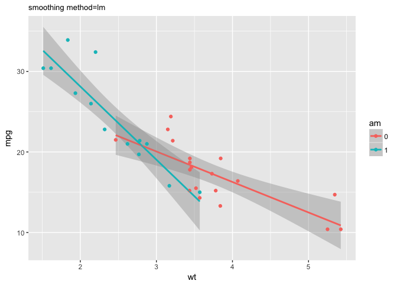

You can draw scatter plot for binary dependent variable. The `GBSG2` data contains data of 686 observations from the German Breast Cancer Study Group 2(GBSG2) study. You can get logistic regression line with a jittered scatterplot by setting the parameter `method` `glm`.

``` r
require(TH.data)
data(GBSG2)
ggPoints(aes(x=pnodes,y=cens),data=GBSG2,method="glm")
```

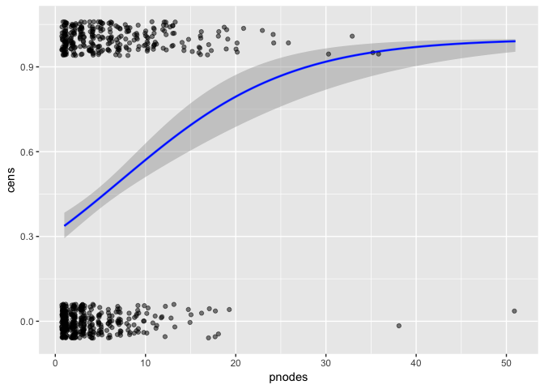

Please check the vignette for "ggPoints" at <http://rpubs.com/cardiomoon/231822>

ggRadar() for interactive radar chart
-------------------------------------

You can explore a data.frame with ggRadar() or ggBoxplot().

``` r
ggRadar(data=iris,aes(color=Species))
```

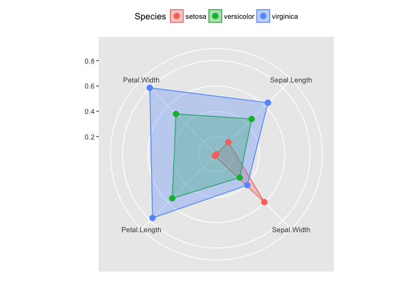

``` r
ggRadar(data=mtcars,aes(colour=am))
```


ggSpine() for an interactive spinogram
--------------------------------------

ggSpine() is a interactive ggplot version of spineplot(). Spine plots are a special cases of mosaic plots, and can be seen as a generalization of stacked (or highlighted) bar plots. Analogously, spinograms are an extension of histograms. You can add labels by setting the parameter addlabel=TRUE.

``` r
require(moonBook)
ggSpine(data=acs,aes(x=age,fill=smoking))
```

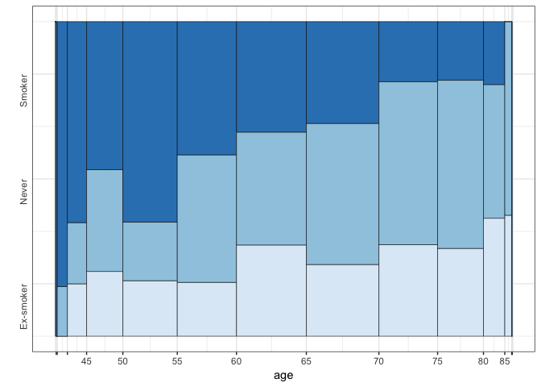

``` r
ggSpine(data=acs,aes(x=Dx,fill=smoking),addlabel=TRUE)
```

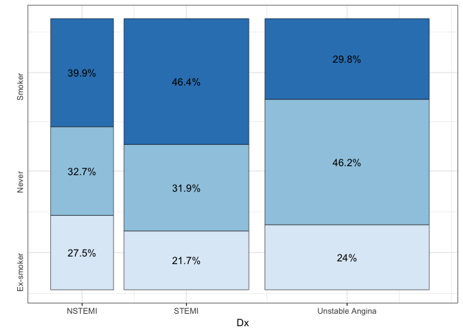 \#\# ggBar() for an interactive barplot

ggBar() draws interactive barplot. You can add labels, draw horizontal barplots or polar plots. You can draw histogram with ggBar()

``` r
ggBar(acs,aes(x=Dx,fill=smoking),addlabel=TRUE,horizontal=TRUE,width=0.5)
```

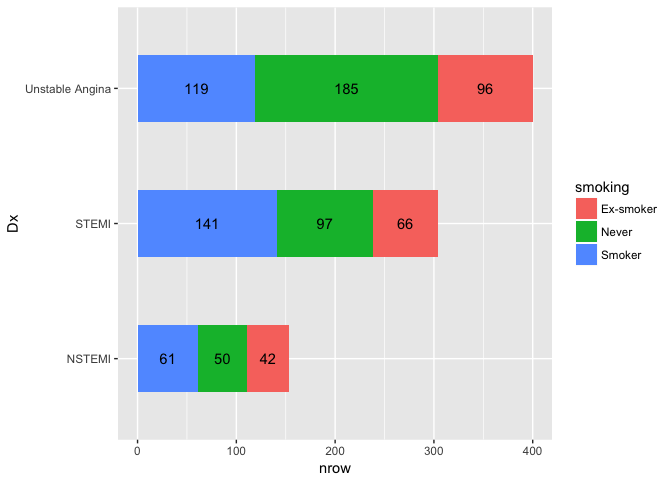

``` r
ggBar(rose,aes(x=Month,fill=group,y=value),stat="identity",polar=TRUE,palette="Reds",width=1,
       color="black",size=0.1)
```

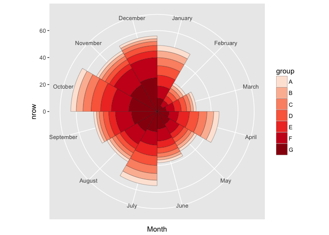

``` r
ggBar(acs,aes(x=age,fill=smoking),addlabel=TRUE,horizontal=TRUE,width=0.5)
```


ggPair() for an interactive scatter plot with line plot
-------------------------------------------------------

``` r
ggPair(iris[3:5])
```

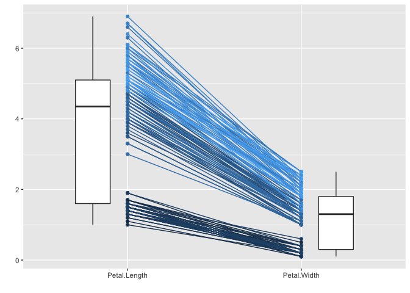

``` r
ggPair(iris,aes(color=Species),horizontal=TRUE)
```


ggPieDonut() for a pie and donut plot
-------------------------------------

You can draw a pie and donut plot with ggPieDonut().

``` r
ggPieDonut(acs,aes(pies=Dx,donuts=smoking))
```

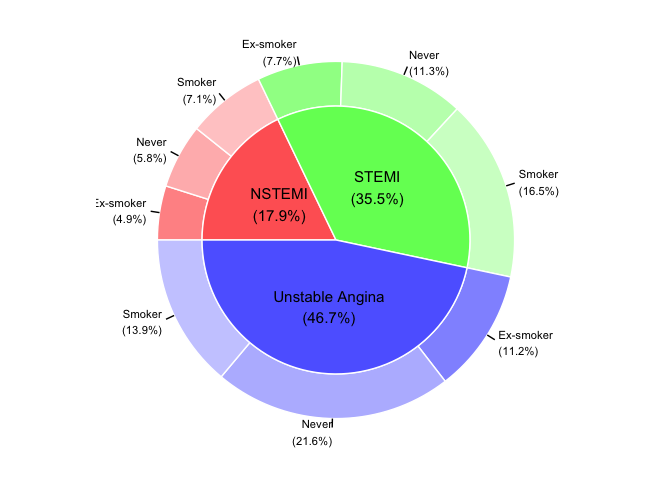

``` r
ggPieDonut(browsers,aes(pies=browser,donuts=version,count=share))
```

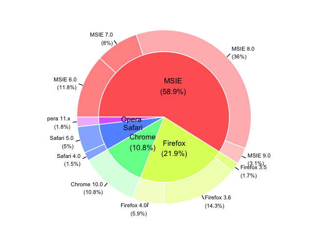

``` r
ggDonut(browsers,aes(donuts=version,count=share))
```

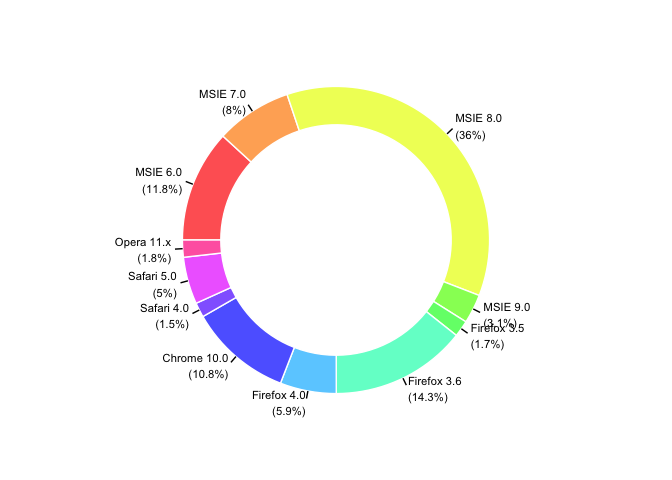

ggCLE() for a cleveland dot plot
--------------------------------

``` r
require(gcookbook)
mtcars$name=rownames(mtcars)
ggCLE(data=mtcars,aes(x=mpg,y=name,color=am,facet=am))
```


``` r
ggCLE(data=tophitters2001,aes(x=avg,y=name,color=lg,facet=lg),no=20)
```


Full version of this vignette
-----------------------------

You can find the full version of this vignette at <http://rpubs.com/cardiomoon/231820>

Shiny app for interactive plot
------------------------------

You can find the shiny app for interactive plot using the ggiraphExtra package at:

<http://web-r.org:3838/explore>

<http://r-ggplot2.com:3838/explore>

<http://web-r.club:3838/explore>
